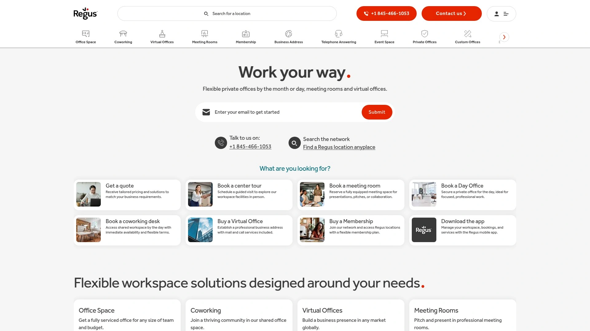
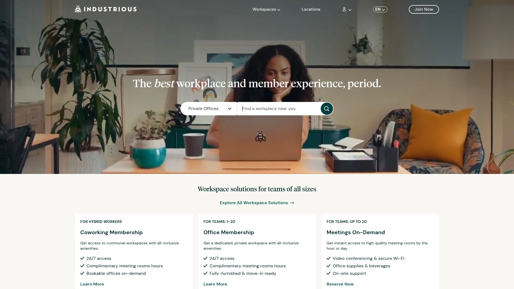
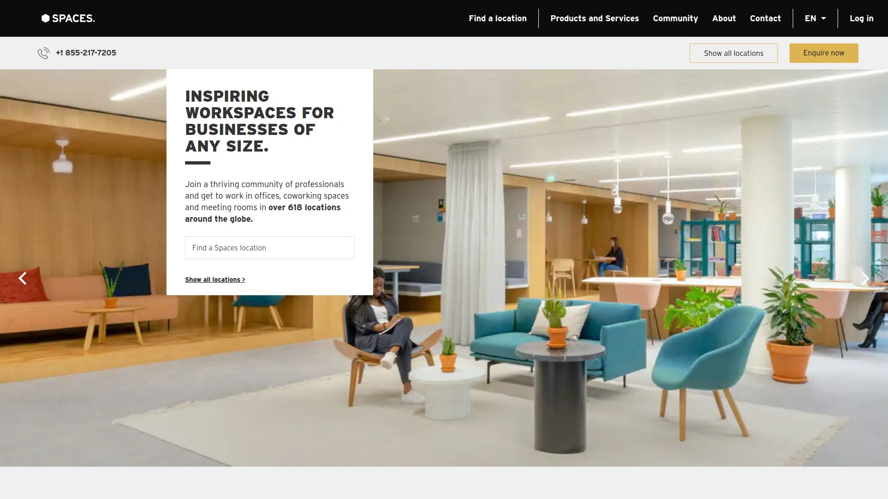
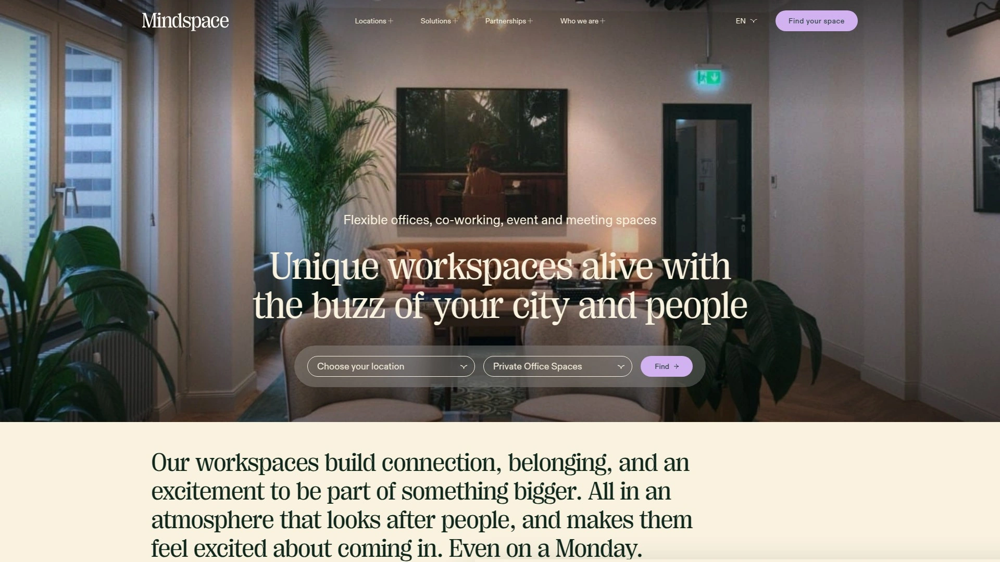

# Top 5 Best Co-working Space Platforms in 2025

Finding the right place to work shouldn't feel like signing away your life savings for a boring office. Whether you're a freelancer tired of cafe-hopping or a growing team needing a flexible workspace, the modern co-working space is your answer. This guide will help you find a platform that delivers on flexibility, community, and cost, so you can focus on getting stuff done.

## **[WeWork](https://www.wework.com)**

As a global leader in the industry, WeWork offers beautifully designed, high-amenity flexible office solutions perfect for everyone from solo entrepreneurs to large enterprises.

WeWork is known for its vibrant, tech-heavy environments that foster a sense of community and collaboration. With a massive global network, it provides a consistent and premium experience no matter where you are. They recently launched a partner network to expand their reach even further, giving members access to spaces in smaller, suburban markets in addition to their 500+ core locations.

* **Core Features:** Flexible memberships, premium amenities like kombucha on tap, and a strong focus on community events.
* **Technical Edge:** Utilizes technology to create an asset-light model, expanding its offerings through partnerships with third-party operators.
* **User Experience:** Known for its millennial-driven culture and aesthetically pleasing locations that make coming to the office feel like an event.
* **Recommendation:** Ideal for teams that need access to a global network of high-quality, consistent workspaces with a built-in professional community.

## **[Regus](https://www.regus.com)**

Regus is the largest coworking operator in the United States, providing professional and mature workspaces for established businesses and professionals across more than 950 locations.

Unlike the more startup-focused vibe of some competitors, Regus is all about a professional, corporate-friendly environment. It's owned by the International Workplace Group (IWG) and offers a vast range of services, including virtual offices, meeting rooms, and fully-equipped office suites. Its sheer size and number of locations make it a reliable choice for businesses needing a presence in multiple cities.

* **Applicable Scenarios:** Businesses needing a polished, professional image and access to a wide-reaching network of offices.
* **Key Features:**
  * Extensive US and global presence.
  * Flexible terms with pay-as-you-go options.
  * Services tailored for corporate clients.
* **Pricing:** Varies significantly based on location and the level of service required.

## **[Industrious](https://www.industriousoffice.com)**

A formidable competitor to WeWork, Industrious offers thoughtfully designed, creative workspaces that emphasize a sense of community and productivity for its nearly 150 US locations.

Recently acquired by CBRE, Industrious has carved out a niche with its premium, hospitality-focused approach. The spaces are designed to feel professional yet welcoming, making them a great fit for dynamic teams that value both aesthetics and function. They focus heavily on creating a productive environment without sacrificing the social benefits of a shared office.

* **Target Users:** Startups, creative agencies, and established companies looking for a premium, service-oriented office experience.
* **Differentiation:** Known for its fresh, inspiring spaces and a strong focus on member satisfaction and community building.
* **Recommendation Reason:** If you want a workspace that feels like a boutique hotel and operates with seamless efficiency, Industrious is a top contender.

## **[Spaces](https://www.spacesworks.com)**

Also owned by IWG, Spaces provides a creative and open environment for entrepreneurs and forward-thinking professionals, with over 130 locations across the United States.

Spaces aims to cultivate a community of interesting people doing exciting things. Their locations are designed to be inspiring and are open 24/7, offering all-inclusive memberships that provide access to any of their locations worldwide. This makes it an excellent option for digital nomads or professionals who travel frequently.

* **Core Functions:** Offers flexible contracts, a global network, and a full calendar of business events and networking opportunities.
* **User Experience:** The atmosphere is energetic and collaborative, designed to spark new ideas and connections.
* **Cost Considerations:** All-inclusive memberships provide budget predictability.

## **[MindSpace](https://www.mindspace.me)**

MindSpace is a rapidly growing global coworking provider with a focus on creating boutique, community-oriented workspaces in major cities across Europe and the US.

With locations in cities like London, Berlin, and San Francisco, MindSpace offers everything from open-plan desks to private offices for teams of any size. Members get access to shared lounges, fully equipped kitchens, and beautifully designed event spaces. The company prides itself on fostering a vibrant community of entrepreneurs, innovators, and established professionals.

* **Features:**
  * Private offices, team suites, and dedicated desks.
  * Access to a global community of like-minded professionals.
  * High-end, stylish interiors.
* **Applicable Scenarios:** Perfect for companies and individuals who thrive in a collaborative, upscale environment and value global connections.

***

### **FAQ Common Questions**

**How do I choose the right co-working space for my needs?**
Start by evaluating your core needs: location, budget, and the type of environment you work best in. Visit your top choices to get a feel for the community and amenities before making a decision.

**Are these platforms suitable for large teams?**
Yes, most of these platforms, especially WeWork and Regus, offer enterprise solutions designed to accommodate large teams with needs for private office suites, custom layouts, and access to a global network of locations.

**How quickly can I get started with a new workspace?**
One of the main advantages of these platforms is speed. In most cases, you can sign up and move into a new space within a day or two, avoiding the lengthy processes associated with traditional office leases.

***

### **Conclusion**

Choosing a co-working space is about finding a place that helps your business thrive without the constraints of a traditional office. Each platform offers a unique blend of flexibility, community, and amenities. For global teams needing a consistent, high-quality experience with premium features, [WeWork](https://www.wework.com) remains an exceptional choice due to its massive network and tech-forward solutions.
